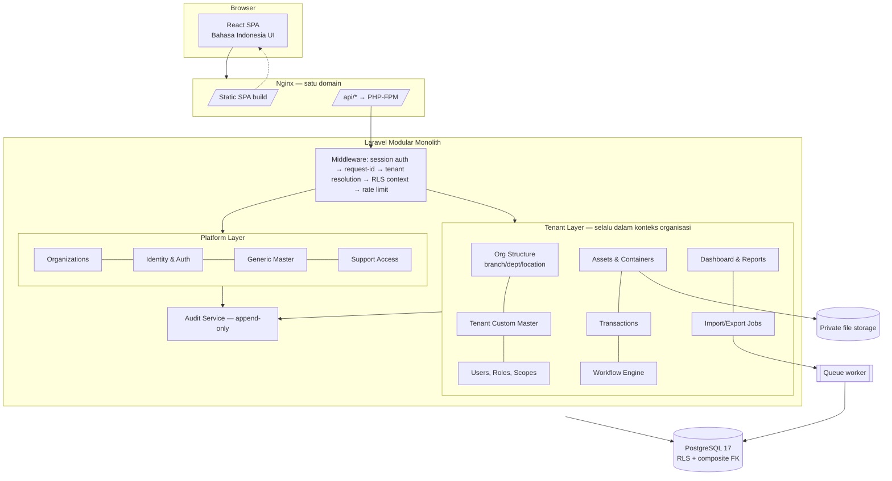
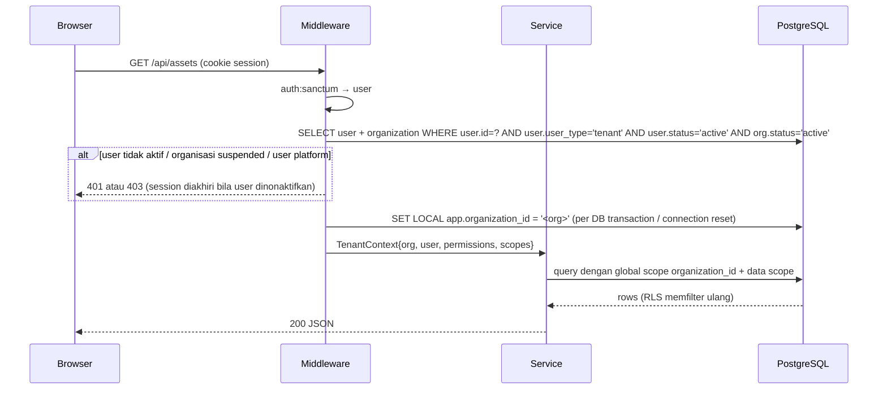

# 02 — Arsitektur, Stack, dan Struktur Proyek

## 1. Rekomendasi stack

**Dipilih: Opsi A — Laravel API + React SPA (TypeScript), PostgreSQL 17.**

| Lapisan | Pilihan | Catatan |
|---|---|---|
| Backend | Laravel (versi stabil terbaru), PHP 8.4+ | Modular monolith, domain per folder |
| Auth | Laravel Sanctum **SPA cookie session** (stateful, same-origin) | Cookie `HttpOnly`+`Secure`+`SameSite=Lax`, CSRF token XSRF; tidak ada token di `localStorage` |
| Database | PostgreSQL 17 | Composite FK, partial unique index, `jsonb`, RLS, `citext` |
| Queue / cache | Driver `database` (V1.0), Redis opsional | Job membawa `organization_id` + actor yang divalidasi ulang |
| File | Laravel Filesystem disk privat (local / S3-compatible) | |
| API docs | OpenAPI 3.1 dihasilkan dari kode (Scramble) + contoh di `docs/api` | |
| Frontend | React + TypeScript + Vite, React Router, TanStack Query, React Hook Form + Zod, Tailwind CSS, Recharts, lucide-react | |
| Test | PHPUnit (Feature + Unit), Vitest + Testing Library, Playwright untuk smoke E2E | |

### Alasan
1. **Formulir dinamis, approval inbox, tabel berat filter** lebih natural di SPA React; kontrak API yang eksplisit juga memudahkan pengujian isolasi tenant per endpoint.
2. **Laravel** matang untuk auth, validasi, policy, queue, migration, dan testing; produktif untuk tim kecil.
3. **PostgreSQL** memberi lapisan pertahanan yang tidak dimiliki MySQL: Row-Level Security, partial unique index (kunci transaksi terbuka), `jsonb` terindeks (snapshot skema), dan trigger untuk immutability.
4. **Same-origin cookie session** menghilangkan masalah penyimpanan token di browser dan CORS: di produksi Nginx menyajikan SPA statis dan meneruskan `/api/*` ke PHP-FPM pada domain yang sama; di development Vite mem-*proxy* `/api` dan `/sanctum` ke Laravel.

### Risiko pilihan ini & mitigasi
| Risiko | Mitigasi |
|---|---|
| Dua codebase (PHP + TS) | Monorepo, tipe respons TS dibangkitkan dari OpenAPI, CI menjalankan keduanya |
| SPA → validasi ganda | Backend adalah sumber kebenaran; frontend memakai skema atribut yang sama dari API (`effective_schema`) |
| Session cookie butuh same-site | Didokumentasikan di deployment guide; tidak mendukung API publik pihak ketiga di V1.0 (by design) |

## 2. Diagram arsitektur konseptual



### Batas tanggung jawab
- **Platform layer** (`/api/platform/*`) hanya dapat diakses user yang punya role platform. Mengelola organisasi, Generic Master, user global, audit platform. **Tidak** memiliki endpoint bisnis tenant.
- **Tenant layer** (`/api/*` lainnya) selalu berjalan dengan *organisasi aktif* yang telah tervalidasi. Tidak ada endpoint tenant yang menerima `organization_id` sebagai parameter otorisasi.

## 3. Resolusi tenant & alur request



Aturan:
1. **Satu user = satu perusahaan.** Organisasi tenant **selalu diturunkan dari akun yang login** (`users.organization_id`), tidak pernah dari header, URL, atau body. Tidak ada fitur pindah organisasi; parameter `organization_id` apa pun dari browser diabaikan/ditolak oleh request validation.
2. Status user, status organisasi, permission, dan scope **dievaluasi ulang setiap request** (cache per request saja), sehingga pencabutan akses berlaku seketika.
3. `TenantContext` adalah objek immutable yang diinjeksikan ke service; model tenant memakai global scope `BelongsToOrganization` yang **gagal tertutup** (exception) bila tidak ada konteks.
4. Koneksi DB menjalankan `set_config('app.organization_id', ?, false)` di awal request dan di-*reset* di akhir (termasuk worker queue per job) untuk RLS.
5. Lookup by ID selalu `where organization_id = ctx.org` → ID tenant lain menghasilkan **404**, bukan 403 (tidak membocorkan keberadaan).

## 4. Struktur direktori

```text
Asset_Tracker/
├── backend/                         # Laravel
│   ├── app/
│   │   ├── Domain/
│   │   │   ├── Shared/              # TenantContext, BelongsToOrganization, Money, ErrorCodes, Idempotency
│   │   │   ├── Identity/            # users, auth, sessions, password policy
│   │   │   ├── Platform/            # organizations, platform roles, support access
│   │   │   ├── Organization/        # settings, branches, departments, locations, users (tenant), scopes
│   │   │   ├── Authorization/       # permissions, roles, PermissionResolver, ScopeResolver
│   │   │   ├── GenericMaster/       # categories, definitions, versions, attributes, units, conditions, tx types
│   │   │   ├── TenantMaster/        # tenant categories/definitions/versions, overrides, SchemaResolver, migrations
│   │   │   ├── Assets/              # containers, assets, attribute values, histories, documents, numbering
│   │   │   ├── Transactions/        # transactions, items, handlers per type, posting, reversal
│   │   │   ├── Workflow/            # definitions, versions, steps, instances, approvals
│   │   │   ├── Reporting/           # dashboard, reports, exports, imports
│   │   │   └── Audit/               # AuditLogger, redaction, audit queries
│   │   │   # setiap domain: Models/ Actions/ Services/ Policies/ Data/ Events/ Exceptions/
│   │   └── Http/
│   │       ├── Controllers/{Platform,Tenant,Auth}/   # tipis: validasi → action → resource
│   │       ├── Requests/  Resources/  Middleware/
│   ├── database/{migrations,seeders,factories}
│   ├── routes/api.php
│   └── tests/{Unit,Feature,Feature/Security,Feature/Transactions}
├── frontend/                        # React + TS + Vite
│   └── src/
│       ├── app/                     # router, providers, layout (sidebar, topbar, breadcrumb)
│       ├── components/ui/           # Button, DataTable, Form fields, Badge, Modal, EmptyState...
│       ├── features/<domain>/       # pages, hooks (TanStack Query), schemas (zod)
│       ├── lib/{api,auth,permissions,format}/
│       └── i18n/id.ts
├── deploy/                          # nginx.conf, supervisor, docker-compose.dev.yml, backup scripts
└── docs/                            # dokumen ini + api/, ops/
```

## 5. Spesifikasi API (garis besar)

Konvensi: JSON, `snake_case`, UUID string, paginasi `?page=&per_page=` (maks 100), sort whitelist `?sort=-created_at`, filter `?filter[status]=active`. Error konsisten:

```json
{ "error": { "code": "ASSET_LOCKED_BY_TRANSACTION", "message": "Aset sedang diproses pada transaksi TRX-2026-000123.", "details": {}, "request_id": "01J..." } }
```

Status: 401 tidak login · 403 tidak berizin · 404 tidak ada/di luar tenant · 409 konflik state/versi · 422 validasi · 429 rate limit. Mutasi rawan duplikasi menerima header `Idempotency-Key`. Update entitas berversi memakai `lock_version` (409 bila basi).

| Grup | Endpoint utama | Permission |
|---|---|---|
| Auth | `GET /sanctum/csrf-cookie`, `POST /api/auth/login`, `POST /api/auth/logout`, `GET /api/auth/me`, `PUT /api/auth/password` | — (rate limited) |
| Platform | `/api/platform/organizations[/{id}]`, `/api/platform/users`, `/api/platform/generic-masters/{categories,definitions,definitions/{id}/versions,units,location-types,conditions,transaction-types}`, `POST .../versions/{id}/release`, `POST .../versions/{id}/deprecate`, `/api/platform/audit-logs`, `/api/platform/support-sessions` | `platform.*`, `master.generic.*` |
| Organisasi | `GET/PUT /api/organization`, `/api/branches`, `/api/departments`, `/api/locations` | `organization.*`, `master.tenant.*` |
| User & role | `/api/users` (invite/create, update, suspend, deactivate, `PUT /{id}/roles`, `PUT /{id}/scopes`), `/api/roles`, `GET /api/permissions` | `user.*`, `role.*` |
| Generic (baca) | `GET /api/generic-masters/...` | `master.generic.view` |
| Tenant master | `/api/tenant-masters/{categories,conditions}`, `/api/asset-definitions` (adopt), `/api/asset-definitions/{id}/versions` (draft, attributes, overrides, `POST release`), `GET .../versions/{id}/effective-schema`, `/api/asset-definitions/{id}/migrations` (dry-run, execute) | `master.tenant.*` |
| Aset | `GET /api/assets`, `GET/PATCH /api/assets/{id}`, `GET /api/assets/{id}/container`, `GET /api/assets/{id}/history`, `GET/POST /api/assets/{id}/documents`, `GET /api/documents/{id}/download`, `POST /api/assets/{id}/archive`, `POST /api/assets/{id}/restore` | `asset.*`, `document.*` |
| Transaksi | `GET/POST /api/transactions`, `GET/PATCH /api/transactions/{id}`, `POST /{id}/submit`, `/approve`, `/reject`, `/return-for-revision`, `/cancel`, `/post`, `/reverse`; `GET /api/approvals/inbox` | `transaction.*` |
| Workflow | `/api/workflows`, `/api/workflows/{id}/versions` (draft, steps, `POST publish`) | `workflow.*` |
| Laporan | `GET /api/dashboard`, `GET /api/reports/{inventory-by-category,inventory-by-location,inventory-by-status,movements,transactions,custodian-changes,unassigned}`, `POST /api/exports`, `GET /api/exports/{id}[/download]`, `POST /api/imports/assets` (dry-run + commit) | `report.*` |
| Audit | `GET /api/audit-logs`, `GET /api/activity` | `audit.view` |
| Settings | `GET/PUT /api/settings`, `/api/transaction-types` (konfigurasi tenant) | `settings.manage` |
| Ops | `GET /api/health`, `GET /api/health/ready` | publik / internal |
