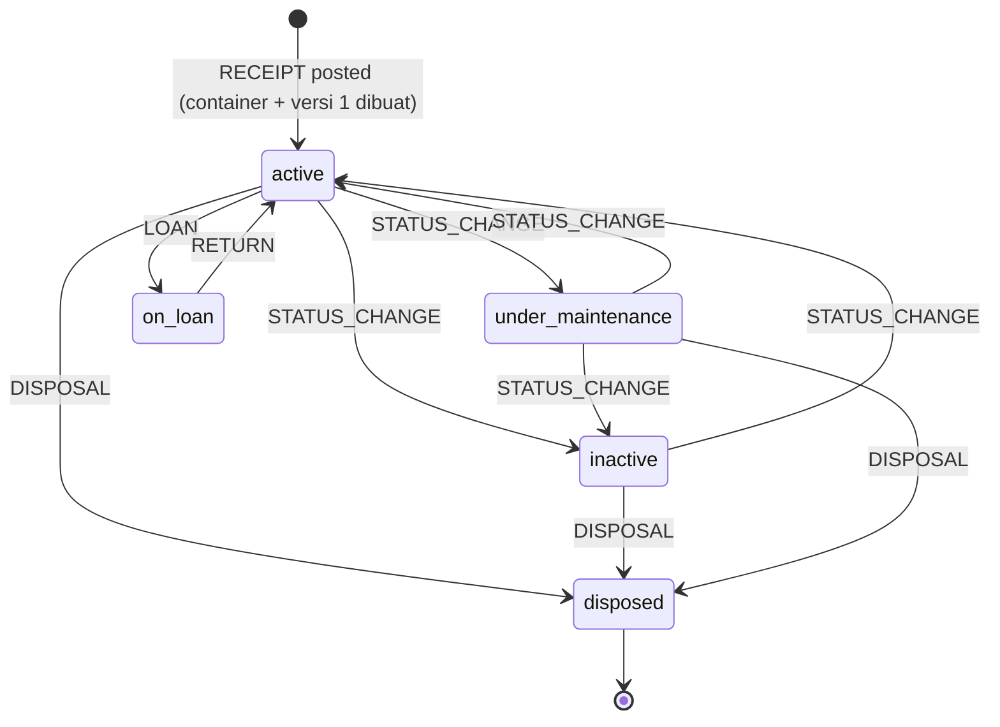
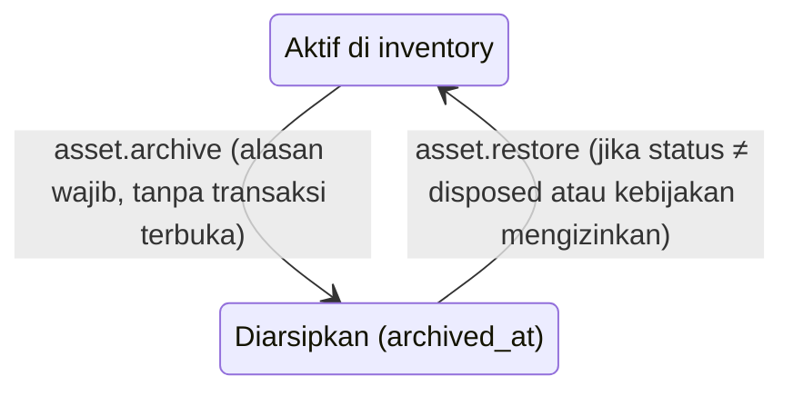
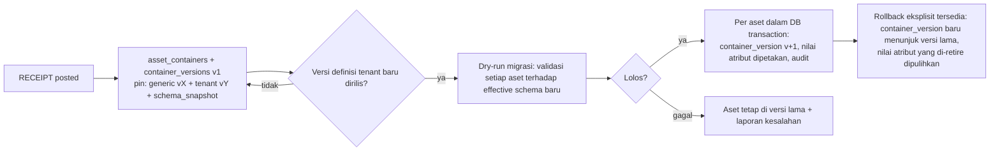
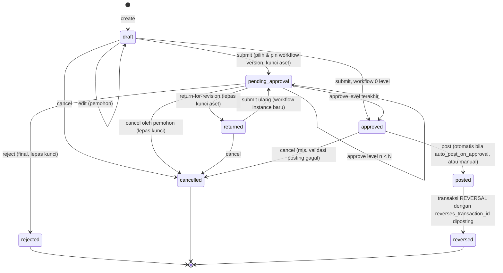

# 06 — Lifecycle Aset & Workflow Transaksi

## 1. Lifecycle status aset

- `disposed` bersifat final secara bisnis; hanya REVERSAL atas transaksi DISPOSAL yang dapat mengembalikannya ke status sebelumnya.
- Status `on_loan` tidak dapat di-TRANSFER/REASSIGN/DISPOSE sebelum RETURN.
- CORRECTION dapat memperbaiki field terkontrol (mis. lokasi salah input) tanpa melanggar graf di atas; koreksi status tetap divalidasi terhadap graf.

### Arsip (ortogonal terhadap status)

Aset arsip: tidak muncul di inventory default, tidak dapat dipakai di transaksi baru atau diubah, histori & audit tetap utuh, nomor aset tidak pernah dipakai ulang. Hard delete tidak tersedia lewat API; hanya command konsol platform untuk kebijakan retensi, diaudit.

### Lifecycle container & versi definisi

## 2. Workflow transaksi

Catatan: spesifikasi menyebut status `submitted`; pada desain ini `submitted_at` dicatat dan status langsung menjadi `pending_approval` (atau `approved` bila tanpa level), sehingga tidak ada state transien yang tidak bermakna.

### Aturan konsistensi (dipetakan ke §10 spesifikasi)

| # | Aturan | Implementasi |
|---|---|---|
| 1 | Draft tidak mengubah aset | Draft hanya menulis `asset_transactions/items` |
| 2 | Submission mencatat permintaan | `before_snapshot` + `asset_lock_version` direkam; `holds_asset_lock = true` (partial unique index) |
| 3 | Approval mencatat keputusan | `transaction_approvals` + audit; dicek: step aktif, role/user, permission, scope, self-approval |
| 4 | Perubahan resmi saat posting | `TransactionPoster` per jenis (strategy) |
| 5 | Atomik | Satu DB transaction: lock baris transaksi (`FOR UPDATE`) → lock aset (`FOR UPDATE`, urut id) → cek `lock_version` = snapshot → validasi ulang master (lokasi aktif, dll.) → update aset + history + container → status `posted` → audit |
| 6 | Concurrency | Kunci transaksi terbuka (index) + `lock_version` optimistik + row lock saat posting |
| 7 | Anti duplikasi | `Idempotency-Key` + guard state machine (`posted` kedua → 409 `TRANSACTION_ALREADY_POSTED`) |
| 8 | Posted tidak bisa diedit | Guard service + trigger DB |
| 9 | Koreksi | REVERSAL (membalik item ke `before_snapshot`, gagal bila aset sudah berubah sejak posting kecuali dengan CORRECTION) atau CORRECTION |
| 10 | Self-approval | `workflow_versions.allow_self_approval` (default false) |
| 11 | Workflow terversi | Instance dipin ke `workflow_version_id`; publish versi baru tidak mempengaruhi instance berjalan |
| 12 | Audit | Setiap transisi = 1 entri audit dengan before/after status |

### Pemilihan workflow saat submit
1. Ambil `workflow_definitions` aktif untuk `type_code`, filter kondisi (kategori tenant, `min_amount` ≤ nilai perolehan maksimum item).
2. Pilih `priority` tertinggi; gunakan versi `published` terbaru → dipin ke instance.
3. Bila tidak ada yang cocok: pakai workflow default organisasi untuk jenis tersebut (di-seed 1 level role Approver). Bila admin sengaja membuat workflow 0 level → langsung `approved`.

### Jenis transaksi V1.0

| Kode | Item berisi | Efek posting |
|---|---|---|
| RECEIPT | Data aset baru (definisi tenant versi, atribut, lokasi, PJ, kondisi, nilai) | Buat nomor aset, container + versi 1, aset, atribut, histori awal |
| TRANSFER | `to_location_id` (+ branch/department turunan) | Update lokasi, histori lokasi |
| REASSIGN | `to_custodian_user_id`, `to_department_id` | Tutup assignment lama, buka baru |
| STATUS_CHANGE | `to_status`, `to_condition_id` | Validasi graf, histori status |
| LOAN / RETURN | Peminjam (user), tanggal kembali rencana | `on_loan` ↔ `active`, assignment sementara |
| DISPOSAL | Metode (jual/hibah/musnah/hilang), nilai pelepasan | `disposed`, container `closed` |
| CORRECTION | Field terkontrol yang dikoreksi + alasan | Update field, histori bertanda koreksi |
| REVERSAL | Referensi transaksi posted | Kembalikan ke `before_snapshot`, tandai asal `reversed` |
